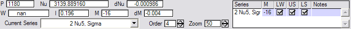

# Loomis-Wood Manual

Loomis-Wood Add-In

Version 2.08

June 3, 2005  (Converted to MarkDown October 22, 2017)

Christopher F. Neese

cfneese@uchicago.edu

http://fermi.uchicago.edu/freeware/LoomisWood.shtml

## Contents

- [Theory](#theory)
- [License](#license)
- [Features](#features)
- [System Requirements](#system-requirements)
- [Upgrading](#upgrading)
- [Getting Started with the Add-In](#getting-started-with-the-add-in)
- [Working with Band Heads](#working-with-band-heads)
- [How It Works](#how-it-works)
- [Troubleshooting](#troubleshooting)
- [Menu/Command Reference](#menucommand-reference)
- [Keyboard Reference](#keyboard-reference)
- [Function Reference](#function-reference)
- [Structures](#structures)
- [Customization](#customization)
- [Revision Notes](#revision-notes)
- [To Do List](#to-do-list)
- [References](#references)

## Theory

Most molecular spectra contain series of lines that are readily fitted to
polynomials of the quantum number _J_, or some index directly related to _J_.
For example, for a linear molecule, the _P_ and _R_ branches can be to fit to the same polynomial
if we use _m_ instead of _J_, where _m_= -_J_ for a _P_-branch line and _m_ = _J_ - 1 for an _R_-branch line.
 
If we plot _m_ verses the residual of such a fit, we have a basic Loomis-Wood plot.
In this plot a well-fit rotational series will appear as a vertical line of points.
If the fit is not optimal but close, a series will appear as a line of points with a small slope
and/or a small curvature from the error of the fit.
It is relatively easy to follow such a series in a Loomis-Wood plot even when the
series is not-so-obvious in the actual spectrum.
The extra dimension of the Loomis-Wood plot creates a higher information-density than in the raw spectrum.
By plotting the Loomis-Wood plot using triangles of height and width proportional to line intensity and line width,
this information density can be increased further.


Loomis and Wood were the first to use this two-dimensional representation of a spectrum in 1928.
While simply drawing Loomis-Wood plots is relatively straightforward, the time required to manually
create a Loomis-Wood diagram limited the usefulness of these plots in the
initial assignment of spectra before the advent of microcomputers.
The first computer program to generate a Loomis-Wood plot was written at the Ohio State University in the 1960s.
When a Loomis-Wood plot is made interactive so that assignments can be made in the plot and linked to an assignment database a powerful tool is created.
The first interactive Loomis-Wood applications by Winnewisser _et al._ appeared in
the 1980s.
The Loomis-Wood add-in follows in the tradition of these interactive programs.

## License

Copyright (c) 2005
Christopher F. Neese

THIS SOFTWARE IS PROVIDED "AS IS", WITHOUT WARRANTY OF ANY KIND, EXPRESS OR IMPLIED,
INCLUDING BUT NOT LIMITED TO THE WARRANTIES OF MERCHANTABILITY, FITNESS FOR A
PARTICULAR PURPOSE AND NONINFRINGEMENT. IN NO EVENT SHALL THE AUTHORS OR
COPYRIGHT HOLDERS BE LIABLE FOR ANY CLAIM, DAMAGES OR OTHER LIABILITY, WHETHER
IN AN ACTION OF CONTRACT, TORT OR OTHERWISE, ARISING FROM, OUT OF OR IN
CONNECTION WITH THE SOFTWARE OR THE USE OR OTHER DEALINGS IN THE SOFTWARE.

For the time being, users should cite this work as:

An Interactive Loomis-wood Package for Spectral Assignment in Igor Pro, Version 2.0.,
Neese, C. F.
_Fifty-sixth Ohio State University International Symposium on Molecular Spectroscopy_,
Columbus, Ohio, June 20-24, 2005.

(Please check the website for latest information on citing this work.)

## Features

* The add-in is Macintosh and Windows compatible. (Version 1.0 was not Macintosh compatible.)
* The add-in provides an organized line/assignment database.
* Lines can be assigned to multiple series.
* Multiple Loomis-Wood data sets can be created within a single Igor experiment.
* Multiple plots of a single Loomis-Wood data set can be created within a single Igor experiment.
* There is a user-extensible extract assignments feature. This feature allows the add-in to be used
easily with external fitting programs.

Since the add-in is written for Igor (instead of as a stand-alone program) all of
Igor’s features are available to the add-in.
For example, printing and graphics export are provided by Igor, not the
add-in.

## System Requirements

The add-in requires Igor 5.02 or later. Performance should be acceptable on any Pentium-4 based computer.

## Upgrading

The data format for version 2.x of the Loomis-Wood add-in is substantially
different from version 1.0.  Therefore no direct upgrade route has been provided.
If you need a method to upgrade an experiment using Loomis-Wood 1.0 to
2.x please contact the author.

If the user needs to update from version 2.x to a newer version of the Add-In, it may
be necessary to close all LW plots and recreate them from the Loomis-Wood menu.
This can be done without losing any assignments, and is only necessary if the user finds odd behavior after an
update.  The author will try to note any upgrades that require this procedure here.

## Getting Started with the Add-In

0. Install Igor Pro or the Igor Pro demo. If you are new to Igor, read [Volume I: Getting Started](http://www.wavemetrics.net/doc/igorman/I-01%20Intro.pdf) of the Igor manual.

1. Copy the "LoomisWood.ipf" procedure file to the "User Procedures" subfolder of the IGOR program folder.
The path for the "User Procedures" folder is typically "C:\Program Files\WaveMetrics\Igor Pro Folder\User Procedures" for a Windows PC.

2. Load/Create a line list of your data in Igor.
(A sample experiment, "ethylene-lw.pxp", which includes a spectrum and line list of
ethylene from HITRAN is provided with the add-in.)
The Add-In requires a listing of line-center frequencies contained in a single 1D wave.
A listing of line intensities and/or line widths is optional.
If provided, these lists should be contained in separate 1D waves.
The intensity wave should reflect absorption not transmission.
Also, the values in the intensity wave should all be positive.

3. Open the procedure window of your Igor experiment. (Press Ctrl-M.)
Add the line
`#include "LoomisWood"` 
to the top of the procedure window.
This will create the **Loomis-Wood** menu and make available all of the procedures associated with this add-in.

4. Create a Loomis-Wood data set by selecting **Loomis-Wood | Data Sets | Create a New Loomis-Wood Data Set...**.
A dialog box will ask you for the name of the new folder, then a second dialog box will ask you to select the waves of your line listing.
You can choose \_constant\_ if you do not have waves with line widths and/or line intensities.
You can work with multiple data sets in the same Igor Experiment by creating multiple Loomis-Wood folders.

5. A Loomis-Wood plot named "Plot0" will be created automatically.
You can create multiple Loomis-Wood plots for the same Loomis-Wood folder by selecting
**Loomis-Wood| Plots | Create a New Loomis-Wood Plot...**
A dialog box will ask you for the Loomis-Wood folder containing the data for the plot, and a name for the subfolder that will contain data specific to the new Loomis-Wood plot.

6. In the new plot you will see the lines from your data set represented as triangles.
The height and width of these shapes will reflect the relative line intensities and the line widths of your data set.
There is a cursor that you can move from line to line using the arrow keys.
If you click on a single line, the cursor will jump to that line. At the top of the
plot the details of the currently selected line are displayed.
You can use the PageUp and PageDn keys to scroll the plot up or down to the region of interest.

7. Edit the band constants to make the
Loomis-Wood plot match a series in your spectrum.
Do this by choosing **Loomis-Wood | Plots | Edit Band Constants...**.
Even if you do not have precise constants for your molecule, you will need to provide
initial guesses for the band origin and rotational constants to get a
meaningful display.

8. If your band constants are reasonable, you should be able to identify a series as a vertical line of triangles in the display area.  You probably will need to scroll to the region of interest using the Page keys if you have not already done so.  If you cannot identify a series, you will need to go back to step 7 and refine your constants.

9. The next step is to assign a series.  Begin by creating a new series by choosing **Loomis-Wood | Series | Start a New Series...**.
You will be asked to name the series and choose a color for the series.  You can now assign the series by selecting the lines to assign with the cursor and pressing the Enter key. You can use the Delete key to remove an incorrect assignment.

10. Once you have a series assigned or partially assigned, you can refine the rotational constants by performing a fit.
Do this by selecting **Loomis-Wood | Series | Fit Current Series**.

11. If the value of _m_ is off (corresponding to misassignment of _J_),
then the constants produced by the fit will be meaningless.
To correct this, choose **Loomis-Wood | Series | M-Shift Current Series...**.
You will be asked for a correction which will be added to the current _m_ values of the current series.

12. Repeat steps 7-11 to assign additional series.
A complete list of assignments can be created by selecting **Loomis-Wood | Data Sets | Extract Assignments...**.

## Working with Band Heads

When a series has a band head, the fitting function is no longer monotonic.
Since the add-in relies on inversion of the fitting function to create the Loomis-Wood plot, this causes problems.To deal with this problem, the add-in calculates the regions of monotonicity of the fitting function.
Initially, the add-in uses the region of monotonicity that includes _m_=0.
The **Loomis-Wood | Plots | Change Region...** command can be used to select another region of monotonicity.
Using this command, both sides of a band head can be assigned.

Please note that when a series has a band head, the width of each line will get
smaller as one approaches the band head.
This gives the Loomis-Wood plot a triangular appearance.
If you notice that a Loomis-Wood plot takes on a triangular or trapezoidal appearance, you can be pretty sure that your
fitting function involves a band head.

Finally note that as one works away from a band head the distance between lines can
become quite large.  If this occurs the Loomis-Wood plot may become unreadable.
To fix this, you should zoom in on the horizontal axis.  This cannot be done with the mouse (as the
add-in overrides mouse input), but can be done via the *Graph* menu or the
command line.
Also, you may need to edit the value of the FIVEMAX_PEAKS_PER_PLOT constant in the procedure file.

## How it Works

The Loomis-Wood Add-In makes extensive use of Igor's data folders.
By using data folders, the add-in is able to work with multiple data sets and plots within a single Igor experiment
file.
An additional advantage is that
the add-in will not accidentally conflict with the user’s other data.
Users unfamiliar with data folders in Igor may want to skim the “Data Folders” chapter in the Igor manual.
The Add-In will create a folder named "root:LW".
(The name of this folder can be changed by modifying the BASE_FOLDER strconstant in the procedure file.)
Within this folder the Add-In will create data set folder(s).
All of the data that the add-in needs for a data set is stored within the data set folder.

### The Loomis-Wood data set folder:

When a new Loomis-Wood data set folder is created, the following subfolders and waves
are created within that folder:

* Lines subfolder:
    Frequency, Intensity, Width, and Assignments
* Series subfolder:
    Name, Color, Order, Data, and Shape
* Band2Poly, Poly2Band, and BandCoeffLabels , and Colors

The waves in the Lines subfolder are copied from the line listing used to create the Loomis-Wood folder.
The waves will be sorted by frequency. Assignments is a text wave reflecting assignments.
An unassigned line will have an empty string in this wave, where as an assigned line will contain a semicolon-separated list of assignments, e.g. "1:-29,1,1,1,;3:10,1,1,1,".
The assignments in this wave are of the form "series:m,mask1,mask2,mask3,note", where _series_ is the number
of the series, _m_ is the polynomial index (related to _J_), and _mask1_, _mask2_, and _mask3_ are 1 or 0 depending on whether the line is used in fitting or not, and _note_ is a note about the assignment.

The waves in the Series subfolder contain information on assigned series.
In particular, Data is a text wave with a semicolon separated list of assignments.
The assignments in this wave are of the form "pnt:m,mask1,mask2,mask3,note", where _pnt_ is the point number
in the Lines subfolder waves and _m_, _mask1_, _mask2_, _mask3_, and _note_ are the same as above.
The first element in these waves applies to unassigned lines.
This allows the color and shape of unassigned lines to be changed.

The shape of a line is a hollow peak for Shape=0, a solid peak for Shape > 0 and invisible for Shape < 0.
Note that invisible lines can still be selected with the cursor.
The color of a line is a number corresponding to RGB pair in the Colors wave.
If a line is assigned multiple times, it will take its color and shape from the first series in the Lines:Assignments string.

The Colors wave is a three-column wave containing RGB values.
These values determine the colors associated with the Series:Color wave.
The labels of this wave contain the names for these colors.
The first row in these waves is used by default for unassigned lines.
This wave can quickly be edited by selecting **Loomis-wood | Data Sets | Edit Colors...**.

The Band2Poly and Poly2Band are the linear transformation matrices between the
polynomial coefficients and rotational constants. With these matrices, curve
fitting can be done using a polynomial and then the results transformed into
rotational constants.   The default constants used are nu0, B", deltaB, D", deltaD, H" and
deltaH".   If the user prefers a different set of constants (such as nu0, B", B', D", D', H", H')
these two matrices can be edited.
The BandCoeffLabels text wave simply contains descriptions for the rotational constants.

In addition to the above waves, the Loomis-Wood folder may contain a Plots folder (containing one or more plot folders),
a SeriesFit folder, and/or an Assignments folder.

The add-in’s "assignment database" is comprised essentially of the Series:Data and
Lines:Assignments waves.   By having the assignment information recorded both “by line” and "by series", the add-in can
quickly access assignment information.   A catch to this system is that any function that modifies assignments must change
both of these waves.   If only one of these two waves is changed, the SynchronizeSeries2Lines() or
SynchronizeLines2Series() functions can be used to recalculate the other wave.

**Warning:  It is very important not to manually edit the waves in the Lines subfolder. Changing these waves can scramble assignments!!!**

If one does need to edit the waves in the Lines subfolder, one should call **Loomis-wood | Data Sets | Synchronize Series to Lines** when finished.
This routine will sort the waves and update the Series folder so that the Loomis-Wood add-in continues to function.
Even with this function, functionality can be lost if one is not careful.
Make sure your experiment is saved before trying this!!!

An alternative to manually editing the Lines subfolder is the **Data Sets | Update Line List...** command.   This
command is provided for situations where the line list is not static.
For example, if the user wants to measure lines as the assignment progresses you would call this function each time you
measured new lines.

**The waves in the Series subfolder may be edited but should not be sorted or redimensioned.
The Data wave in the Series subfolder should not be manually edited.**

If one does need to sort the waves in his folder, run the
**Loomis-Wood | Data Sets | Synchronize Lines to Series** when finished.
Again make sure your experiment is saved before trying this!!!

Band2Poly and Poly2Band may be edited, but they must be matrix inverses of each other.

### The Loomis-Wood plot folder:

A Loomis-Wood plot folder contains the waves used to render a Loomis-Wood plot.
In particular, each plot has a wave named BandCoeff that contains the rotational constants used to create the Loomis-Wood plot.
A Loomis-Wood folder can contain multiple Loomis-Wood folders so that different plots of the same
data set can be shown concurrently.   Four dependency formulas keep the data in the Loomis-Wood plot folder synchronized so that the display is accurate:

	BandCoeffUpdate := DoBandCoeffUpdate(BandCoeff)
	TriangleUpdate := DoTriangleUpdate(Line_LWm,::Lines:Assignments, ::Series:Color, ::Series:Shape, StartM, EndM, Zoom)
	SeriesOrder := DoSeriesOrderUpdate(::Series:Order, CurrentSeries)
	SeriesNameUpdate := DoSeriesNameUpdate(::Series:Name, CurrentSeries)

The use of dependencies to keep the Loomis-Wood plot accurate is important, since the
data that trigger these dependencies are not necessarily changed programmatically.

DoBandCoeffUpdate calculates Line_LWm and Line_DF (delta frequency) whenever BandCoeff
changes.   The Loomis-Wood plot is essentially a scatter plot of Line_LWm vs. Line_DF.
Since BandCoeff changes rather infrequently, Line_LWm and Line_DF can be calculated completely whenever BandCoeff changes, without performance degradation.

However, in order to get the triangle line shape that reflects intensity, width, and
assignment in the Loomis-Wood plot, we actually plot Triangle_Yup,
Triangle_Ydown vs Triangle_X, with the mode of Triangle_Yup set to Fill to
Next.   The Triangle_ waves (including Triangle_Color) are calculated by DoTriangleUpdate.

DoTriangleUpdate executes whenever the ::Lines:Assignments wave is changed.
This occurs whenever an assignment is made, changed or removed.   The response of
making an assignment must be rapid, hence this function must execute as quickly
as possible.   Thus, the Triangle_ waves do not contain information to render the entire line list, but just the portion of the line list that is to be displayed.  
Furthermore, the size of these waves is fixed at FIVEMAX_PEAKS_PER_PLOT.
Redimensioning the Triangle_ waves takes too much time.

The DoSeriesOrderUpdate() function updates the SeriesOrder variable whenever the
user changes the Series:Order wave or changes the current series.
This is done so that the order SetVariable control of the Loomis-Wood plot can reference a variable (SeriesOrder) instead of an element of a wave (::Series:Order[CurrentSeries]).

The DoSeriesNameUpdate() function updates the current series popup menu whenever
the user changes the Series:Name wave or changes the current series.

### Useful Data in the Loomis-Wood plot folder:

There are several waves and variables created in the Loomis-Wood plot folder that may be useful to the user.
In particular, the user may wish to create dependencies to these variables to keep a graph of the original spectrum synchronized with a Loomis-Wood plot.
(See the chapter "Dependencies" in the Igor manual for more information.)
Please note that these variables should be considered "read-only."

The following list is the data most useful for creating other
displays.   The data in the SeriesFit and
Assignments folders (described below) will also be useful.

* startNu, endNu
    The starting and ending frequency of the Loomis-Wood plot.  Note that endNu < startNu is possible when dν/d_m_ < 0.

* startM, endM
    The starting and ending _m_ of the Loomis-Wood plot.

* startP, endP
    The start and ending point numbers of the lines drawn in the Loomis-Wood plot.
    Note that the number of lines drawn is limited by the constant FIVEMAX_PEAKS_PER_PLOT.

* minNu, maxNu
    The current frequency limits of monotonicity of the fitting polynomial.
    Note that if dν/d_m_ < 0, minNu corresponds to maxM and maxNu corresponds to minNu.

* minM, maxM
    The current _m_ limits of monotonicity of the polynomial.

* minP, maxP
    The first and last point number (from the Lines data folder) that are within the limits of monotonicity.

* lwCursor_P
    The point number of the line selected by the Loomis-wood cursor.

* lwCursor_M
    The _m_ value of the line selected by the Loomis-wood cursor.

* lwCursor_Nu
    The frequency of the line selected by the Loomis-wood cursor.

* lwCursor_dNu
    The residual of the line selected by the Loomis-wood cursor.
    (this is the horizontal axis of the Loomis-Wood plot.)

* lwCursor_I
    The intensity of the line selected by the Loomis-wood cursor.

* lwCursor_W
The width of the line selected by the Loomis-wood cursor.

* CombX
    The frequency values of the fitting polynomial.  
    Append CombY vs CombX to a graph of the spectrum and set the mode to sticks to zero to show the fitting polynomial on the original spectrum.

* CombY    
    A wave of ones of the same length as CombX.

* CombM   
    The _m_ values corresponding do CombX.

### The SeriesFit folder:

The SeriesFit folder is where data for a series is extracted for the **Series |
View Current Series…** and **Series | Fit Current Series** commands.  In this folder, you will find the following
waves:

* Frequency
    the frequency of the line.

* Intensity   
    the intensity of the line.

* Width       
    the width of the line.

* theM        
    the y-axis of the Loomis-Wood plot

* Select      
    a flag indicating whether this line will used in fitting.

* Residual  
    the x-axis of the Loomis-Wood plot

If the series is fit, the following waves will contain the results of the fit:

* M_Correl  
    the correlation matrix

* M_Covar  
    the covariance matrix

* W_Coef   
    the coefficients of the fit

* W_Sigma 
    the error in the coefficients of the fit

Note the data in this folder is not synchronized with the Loomis-Wood data set.  Editing the data in this folder will not
assign , unassign, mask, or unmask lines in the data set.

### Assignments folder:

The Assignments folder is where the data from the **Data Sets | Extract
Assignments...** command is collected.  
(The waves in this folder must be updated manually using the Extract
Assignments command.)   When the user
selects Extract Assignments, a dialog will ask for an Assignment Function.  This function is user supplied and must use
the following prototype:

    function LWLabelProto(a, s)
        STRUCT AssignmentListStruct &a
        STRUCT SeriesStruct &s
    end

By implementing this function, the Extract Assignments command can generate a
complete set of quantum numbers compatible with other fitting programs such as
CALFIT.   Some example code is: 

```
function ProlateAsym(a, s)
    STRUCT AssignmentListStruct &a
    STRUCT SeriesStruct &s

    variable i, imax, freq, weight
    imax = numpnts(a.Frequency)

    string DF = GetDataFolder(1)

    SetDataFolder GetWavesDataFolder(a.Frequency, 1)
    Make/T/O/N=(imax) QN_US, QN_LS
    SetDataFolder DF

    string QN

    for (i=0 ; i < imax ; i += 1)
       freq = a.Frequency[i]
        weight = a.LSmask[i] && a.USmask[i]
        QN = ProlateAsymQN(s.Name[a.SeriesIndex[i]], a.theM[i])

        QN_US[i] = QN[0,11]
        QN_LS[i] = QN[12,23]
        sprintf QN, "%s %14.6f %14.6f %15.6f", QN, freq, -0.001, weight

        a.Assignment[i] = QN
    endfor
end

Function/S ProlateAsymQN(name, m)
    string name
    variable m  

    if (ItemsInList(name,",") != 6 )
        return ""
    endif

    string dKa = UpperStr(StringFromList(1,name,","))
    string dJ = UpperStr(StringFromList(2,name,","))
    variable Ka = round(str2Num(StringFromList(3,name,",")))
    string SR = UpperStr(StringFromList(4,name,","))
    variable S = round(str2num (StringFromList(5,name,",")))!=0 

    if (Ka < 0)
        return ""
    elseif (Ka==0 && S != 0)
        return ""
    endif
    
    variable Ka2 = Ka + char2num(dKa) - char2num("Q")
    variable J, J2

    strswitch (dJ)
        // Treat P and R the same so that P and R lines can be fit to same polynomial 
        case "P":
        case "R":
            if (M < 0)
                J = -M
                J2 = J-1
            else
                J = M-1
                J2 = J+1
            endif
            break
        case "Q":
            J = abs(M)
            J2 = J
            break
        default:
            return ""
            break
      endswitch
    
    if (Ka > J || Ka2 > J2)
        return ""
    endif
    
    Variable S2 = abs(S+J2-J)
    
    strswitch (SR)
        case "A":
            if (mod(abs(Ka2 - Ka), 2) != 0)
                return ""
            endif
            S2=mod(S2+1,2)
            break
        case "B":
            if (mod(abs(Ka2 - Ka), 2) != 1)
                return ""
            endif
            S2=mod(S2,2)
            break
        case "C":
            if (mod(abs(Ka2 - Ka), 2) != 1)
                return ""
            endif
            S2=mod(S2+1,2)
            break
        default:
            S2 = NaN
            break
    endswitch

    if (Ka2==0 && S2 != 0)
        return ""
    endif
    Variable Kc = J - Ka + S
    Variable Kc2 = J2 - Ka2 + S2
    String res
    sprintf res, "%3d%3d%3d  1      %3d%3d%3d  0      ", J2, Ka2, Kc2, J, Ka, Kc
    return res
End
```

This above code uses the Series Name wave to assign prolate asymmetric top quantum
numbers.   The series name should be a list of the form _name, DJ, DK, Ka, SR, s_ where _DJ_ is "P",
"Q", or "R", _DK_ is "P", "Q", or "R", etc., _SR_ is "A", "B", or "C", and _s_ = _Ka_ + _Kc_ -­ _J_.
Using the above code as an example, it should be fairly easy to create an assignment function for any type
of molecule.

Note that the data in this folder is not synchronized with the Loomis-Wood data set.
Editing the data in this folder will not assign , unassign, mask, or unmask lines in the
data set.

## Troubleshooting

If you have problems with the add-in, please try the following.

1. If one of the add-in routines aborts, Igor may be left in one of the Loomis-Wood data folders. The telltale symptom of this problem is "missing" data.
You can check the current data folder using the Data Browser, or simply change the datafolder by typing:
`SetDataFolder root:` in the Command Window.

2. If something goes wrong with the Loomis-Wood display, simply close the plot, then Create a New Loomis-Wood Plot
from the Loomis-Wood menu.
This can be done without losing any assignments, and will correct any problems created by
bad constants or accidental user modifications of the graph or underling dependancies.
(Often, you can reuse the existing plot folder name during this fix without any problems.)

3. The Loomis-Wood add-in will only display lines within a single monotonic region of the fit polynomial.
(See Working with Band Heads.)

4. Most of the menu items in the **Loomis-Wood** menu are only available if the top graph is a Loomis-Wood plot.
If a menu item is disabled, make sure you have a Loomis-Wood plot as the top graph.

5. If the Loomis-Wood plot does not respond to keystrokes, check to make sure the plot is the active
window.   You may also find that the plot only responds to keystrokes when the mouse cursor is over the plot area.

## Menu/Command Reference

**Data Sets | Create a New Loomis-Wood Data Set...**            NewLWDataSet()

This command creates a new Loomis-Wood data set.  
The user will be asked for a folder name, then for a wave containing
line frequencies and optional intensities and widths.  These waves will be used to create a new data
set folder and a default plot named “Plot0” will be created.

**Data Sets | Delete a Loomis-Wood Data Set...**                    DeleteLWDataSet("")

This command will delete an existing Loomis-Wood data set.  With a null ("") argument a dialog will ask
for the name of the folder.   Otherwise,
the argument should be the path-free name of the folder to delete.  Before calling this command, all plot windows
should be closed.

**Data Sets | View Line List...**                                               ViewLineList()

This command will create a table of the waves in the Lines subfolder of the data set
associated with the top LW plot.   This
data should not be manually edited, but if editing is necessary, call the **Data Sets | Synchronize Series to Lines** command when finished.

**Data Sets | View Series List...**                  (F8)                  ViewSeriesList()

This command will create a table of the waves in the Series subfolder of the data
set associated with the top LW plot.  
This data can be manually edited, but if sorting or reordering is
neccessary, call the **Data Sets | Synchronize Lines to Series** command
when finished.

**Data Sets | Fit All Series**                           (Shift-F9)          FitAll()

This command will fit each series in the Data Set and create a report in a notebook
named LWresults.   The Command also creates a two-dimensional wave of the band coefficients in the Series folder
named BandCoeffTable.

**Data Sets | Extract Assignments...**          (F9)                  ExtractAssignments("")

This
command will create a table containing a listing of the assigned lines in the
data set.   With a null (“”) argument, the
user will be asked for an optional assignment function.  This function can be used to quickly convert
the add-ins listing to a form suitable for a separate fitting program.  See “The Assignments folder” above.

Please note that the data in the resulting table is not synchronized with the master
line list.  Editing the data in this table will not
assign, unassign, mask, or unmask lines in the data set.

**Data Sets | Update Line List...**                                       
    UpdateLinesFolder(NaN)

This command is designed to be run when your line-listing as been modified outside
of the add-in.   For example, if you
re-measure lines or add lines to the line listing, you should call this
function.   You can also call this
function to add or remove widths and/or intensities from the data-folder.  (Backup your data first, as assignments can
be lost.)   With NaN as an argument, the
user will be asked for a tolerance.   If
lines have only been added ore removed, then tolerance can be 0.  If the line centers have changed however,
tolerance should be larger than zero.   If
a line in the new line listing is within +/- tolerance of the old listing, then
the two lines are considered the same, and the new line will inherit the
assignments of the old line.   If there
are multiple new lines within +/- tolerance of the old line, the closest new
line will inherit the assignments of the old line.  If no line in the new listing is within +/-
tolerance of an assigned line in the old listing, then a warning will be
printed to the history window.

The first thing this command does is duplicate the Lines folder as LinesBak.  Thus, if you have problems, you can copy the
data from the LinesBak subfolder back to the Lines subfolder.

**Data Sets | Synchronize Series to Lines**                            SynchronizeLines2Series()

This command sorts the waves in the Lines subfolder by Lines:Frequency, then
recreates the Series:Data wave from the Lines:Assignments wave.  This is necessary when the waves in the Lines
folder are manually edited.

**Data Sets | Synchronize Lines to Series**                            SynchronizeSeries2Lines()

This command recreates the Lines:Assignments wave from the Series:Data wave.  This is necessary when the waves in the Series
folder are manually sorted, redimensioned or otherwise reordered.

**Data Sets | Edit Colors**                                                      EditColors()

Thiscommand creates a table containing the Colors wave.  This table can be manually edited as needed.


**Plots | Create a New Loomis-Wood Plot...**                         NewLWPlot("","")

This command creates another Loomis-Wood plot.  
With null arguments, the user will be asked for an existing data set and
a name for the new plot.

**Plots | Change M-axis scaling...**               (F11)                 ChangeRange(0,0)

This command can be used to change the y-axis scaling of a Loomis-Wood plot.  With 0,0 as the arguments, the user will be
asked for the new minimum and maximum values for _m_.

**Plots | Edit Band Constants...**                  (F12)                 EditBandConstants()

This command allows the user to manually edit the constants used to draw the lop
Loomis-Wood plot.   This is necessary in
the beginning of an assignment to get the assignment started.  After the assignment is started, one usually
adjusts the constants via **Series | Fit Current Series**.  The change can be undone with **Series |
Undo Last Fit**.

**Plots | Change Region...**                          (Shift-F12)        ChangeRegion()

This command allows the user to select which monotonic region the plot
displays.   This is necessary when working with series that involve band heads.  See [Working with Band Heads](#working-with-band-heads) for more details.


**Series | Start a New Series...**                     (F2)                  AddSeries()

Starts a new series.   The user will be asked for a name and color for the new series.

**Series | Select a Series...**                     (F3)                  SelectSeries()

Changes the current series.

**Series | Delete a Series...**                         (F4)                  DeleteSeries()

Deletes a series.

**Series | Fit Current Series**                        (F5)                  Print
FitSeries(GetCurrentSeriesNumber())

Fits the current series.   Can be undone with **Series | Undo Last Fit**.

**Series | Undo Last Fit**                               (Shift-F5)          UndoFit()

Reverts the constants used in the topmost Loomis-Wood plot to their previous values. (The Undo level is only one.)

**Series | M-Shift Current Series**                 (F6)                  ShiftSeries(GetCurrentSeriesNumber(),0,1)

This command adjusts the assignment of _m_ for the current series and adjusts
the current constants to reflect this change.

**Series | View Current Series...**                 (F7)                  ViewSeries(GetCurrentSeriesNumber())

This command creates a table containing the current series.
This table is not updated when new assignments are made, but is updated upon a fit.

Please note that the data in the resulting table is not synchronized with the master
line list.  Editing the data in this table will not
assign , unassign, mask, or unmask lines in the data set.

**Series | View Series List...**                       (F8)                  ViewSeriesList()

Same as **Data Sets | View Series List...**.

## Keyboard Reference

Key      | Command
---------|-----------------------------------------
F2       | Start a New Series...
F3       | Select a Series…
F4       | Delete a Series…
F5       | FitCurrent Series
Shift-F5 | Undo Last Fit
F6       | M-Shift Current Series
F7       | View Current Series…
F8       | View Series List...
F9       | Extract Assignments...
F11      | Change M-axis Scaling...
F12      | Edit Band Constants...

The actions corresponding to the function keys are described above.

Key      | Command                                 |
---------|-----------------------------------------|
Enter    | Assign Line Enter assigns the current line to the current series.  There is no menu command corresponding to this action.
Delete (Ctrl-Backspace) | Unassign Line (From Current Series) Delete unassigns the current line from the current series.  There is no menu command corresponding to this action. |
Backspace| Reserved                                |
Home     | Reserved                                |
End      | Reserved                                |
Up       | Move Cursor Up                          |
Down     | Move Cursor Down                        |
Left     | Move Cursor Left                        |
Right    | Move Cursor Right                       |
The cursor can also be moved by single-clicking a line with the mouse. ||
PageUp/PageDn | Scroll Up/Down                     |
The graph can also be scrolled using the **Change M-axis Scaling...** (F7) command. |
K        | Toggle Loomis-Wood Fit Flag             |
U        | Toggle Upper State Fit Flag             |
L        | Toggle Lower State Fit Flag             |
The Loomis-Wood fit Flag determines whether the add-in uses a line in a fit or not.   The other two fit flags are provided for external use.   There are no menu commands corresponding to K, U, or L but the flags can also be toggled with the listbox in the control bar of a Loomis-Wood plot. ||

### Loomis-Wood Toolbar



P             
    The point number of the selected line.  (Non-editable)

Nu           
    The frequency of the selected line.   (Non-editable)

dNu         
    The residual of the selected line. (X-axis of plot)  (Non-editable)

W            
    The width of the selected line.   (Non-editable)

I              
    The intensity of the selected line.  (Non-editable)

M
    The _m_ selected line.   (Y-axis of plot)  (Non-editable)

dM          
    The relative residual of the selected line.   (Non-editable)

Current Series
    The current series being assigned.   Changing the series here is equivalent to **Series | Select a Series...**

Order       
    The order to which the current series will be fit.  Editing this value is equivalent to modifying Order on the **Data Sets | View Series List...** table.

Zoom      
    The magnification on the triangle heights in the plot.  Increase this value to focus on weaker series.

Assignments
List Box       The assignments of the current line are listed in the list box on the right hand side of the toolbar.  This is where you can add a note to an assignment, as well as toggle the various flags associated with the assignment (akin to **K**, **U**, and **L** on the keyboard )

## Function List

The functions below are listed in the order they appear in the source code.
In addition, three slashes "///" are used to create comments corresponding to the headings below, allowing for quick
searching.
Only functions used by the menus or various dependency formulas are non-static.
However, the procedure file defines LWA as a module name so static procedures are available using the module syntax.
For example:

     LWA#VMoveCursor(-1)

This has been done to minimize the risk of namespace conflicts and to prevent the
accidental use of some functions.   For example the above function returns an error message if the tow window is not a
Loomis-Wood plot.

A description of most of the non-static functions can be found above.
The static functions are described (as needed) in the source code.

### Menu support functions:

static function/S OnLWmenuBuild()

static function/S LWDynamicMenuItem()

static function About()

### General utility functions:

static function BinarySearch2(w, y)

static function/S Real1DWaveList(arg1,arg2,arg3)

static function/S FolderList(sourceFolderStr)

static function/S TextWave2List(theTextWave)

static function/S DimLabels2List(w, dim)

static function/S List2DimLabels(w, dim, list)

static function/S StandardBandLabels(order)

static function StandardBand2Poly(row, column, deltaJ)

static function poly2(coeff, order, theX)

static function/C bound_poly(coeff, order, theX)

static function CompareFunctions(f1, f2)

### Misc. Loomis-Wood functions:

static function isTopWinLWPlot(theWinType)

static function/S GetPlotList()

static function/S GetPlotFolderList()

static function GetFolders(theWinType, DataSet, PlotFolder)

static function ValidateSourceFolder (DataSet)

### Main Loomis-Wood interface functions:

function NewLWDataSet()

static function/S GetNewLWDataFolder()

static function GetPeakfinderWaves(Line_Frequency, Line_Intensity, Line_Width)

static function VerifyInputWaveDims(Line_Frequencies, Line_Intensities, Line_Widths)

static function GetNumLines(Line_Frequencies,Line_Intensities,Line_Widths)

static function NewLinesFolder(SourceDF, LWDF)

static function NewSeriesFolder(DataSet)

function DeleteLWDataSet(DataSet)

function DeleteLWPlotFolder(PlotFolder)

function ViewLineList()

function EditColors()

function NewLWPlot(DataSet, PlotFolder)

#### Data dependency functions:

function DoBandCoeffUpdate(BandCoeff)

function DoSeriesOrderUpdate(Series_Order, CurrentSeries)

function DoTriangleUpdate(LWm, Assignments, Series_Color, Series_Shape, StartM, EndM, Zoom)

#### Loomis-Wood plot hook functions:

function LWHookFunction(s)

function OrderSetVarProc(ctrlName,varNum,varStr,varName) : SetVariableControl

function CurrentSeriesPopupMenuControl(ctrlName,popNum,popStr) : PopupMenuControl

function ListBoxProc(LB_Struct) : ListBoxControl

### Loomis-Wood plot event handlers:

static function HitTest(s)

static function NearestPeak(theX, theY)

static function VerticalScroll(Amount)

static function LinesPerFrame()

static function UpdateCursor()

static function AssignmentString2ListBoxWaves(str, seriesNames, tw, sw)

static function MoveCursor(theP)

static function CursorPosition()

static function CursorM()

static function VMoveCursor(Amount)

static function HMoveCursor(Amount)

function ChangeRange(theMin, theMax)  //F11

#### Series-related functions:

function AddSeries() // F2

function SelectSeries() // F3

static function ChangeCurrentSeries(theSeries)

function DeleteSeries() // F4

function GetCurrentSeriesNumber()

function/S FitSeries(theSeries) // F5

function/S GetFitRes(s)

function FitAll()

function/S UndoFit() // Shift-F5

static function FetchSeries(theSeries)

function ShiftSeries(theSeries, theShift, autoFixConstants)   // F6

static function ShiftConstants(theShift)

function ViewSeries(theSeries) // F7

function ViewSeriesList() // F8

function EditBandConstants() //F12

static function ChangeRegions()

### Assignment-related functions:

structure AssignmentStruct

static function ReadAssignment(theP, theSeries, s)

static function AssignLine2(s)

static function AssignLine(theP, theSeries, theM, LWmask,
USmask, LSmask, Notes)

static function UnAssignLine(theP, theSeries)

function ExtractAssignments(functionName)    // F9

Structures:

structure SeriesStruct

static function GetSeriesStruct(DataSet, s, [flag])

structure LinesStruct

static function GetLinesStruct(DataSet, s, [flag])

structure AssignmentListStruct

static function GetAssignmentListStruct(DataSet, s,
[flag])

structure SeriesFitStruct

static function GetSeriesFitStruct(DataSet, s, [flag])

### New stuff:

function SynchronizeSeries2Lines()

function SynchronizeLines2Series()

function UpdateLinesFolder(FreqTol)

## Structures

The data contained in the Lines, Series, Assignments, and SeriesFit subfolders is
accessible through structures.   Use the
GetLinesStruct(), GetSeriesStruct(), GetAssignmentListStruct(), and
GetSeriesFitStruct() functions to create a structure referencing these
folders.   This greatly simplifies writing
functions to access this data, and simplifies the code of the add-in as well.

The add-in does not implement structures for the data in a plot subfolder.  The reason for this is that many of the
functions that use this data need fast response to prevent the add-in from
becoming sluggish.   Since dereferencing a
global data object involves a significant overhead, it is best to only
dereference (using NVAR, SVAR, and WAVE). the objects needed.

## Customization

There are several function of the Add-In that the user may want to customize.  The most important is the Extract Assignments
feature, which has already been discussed.  
(See [The Assignments Folder]().)   There are several
other function this user may want to customize.  
Most of these can be changed using [Function Overrides](), although you can edit the main
procedure file if you want.   Functions the user may want to customize are:

static function/S StandardBandLabels(order)

static function StandardBand2Poly(row, column, deltaJ)

These two functions create the Band2Poly, Poly2Band and
BandCoeffLabels waves.   If one overrides
these functions, you can alter the fitting constants for all new data sets in
an entire experiment.   (You can also edit
these waves manually on a per-data-set basis.)  
For example, you may prefer to fit series in terms of _B_’ and _B_”
instead of _B_” and D_B_.   Another
example would be changing the fitting for D_J_ = 2 transitions.  If you want to change the fitting to a
non-polynomial model, a lot more work is involved. However it should be possible by editing any
function that uses the PolyCoeff wave.

function/S GetFitRes(s)

Overriding this function allows the user to customize the output the fitting routine prints after every fit.

### Globalization

All text used in dialogs is contained in strconstants at the top of the procedure file.   If someone needs to translate the text, all that needs to be edited are these constants, and the menu that immediately follows these constants.

## Revision Notes

### 1.00
     
- Loomis-Wood Add-In first released.

### 2.00         

- LWA is no longer dependant on SetWindowExt XOP, but requires Igor 5.02.
  LWA currently does not respond to wheel or double-click mouse events, because of this change.
  However, it should be Mac compatible.

### 2.01         

- Colors are now based upon a RGB color wave named M_Colors.
        
- The control bar of a Loomis-Wood plot is now a sub-window.
               
- A zoom feature was added.
               
- Assignments are now tracked with text waves.
               
- More error handling was added to FitSeries.
     
- Added Undo last fit.
               
- All Make commands specify precision explicitly, preventing accidental use of single precision.

### 2.05
     
- Reorganized data folder structures:
               
- Waves that previously began with “Peak_” are now in the Lines subfolder.
  Waves that previously began with "Series_" are in the Series subfolder.
  All plot folders are now within a Plots subfolder instead of in the base LW data folder.
               
- Added structures and functions to create structures so that coding with the new folder structure is more transparent.
               
- Reorganized Loomis-Wood menu.
             
- Converted control bar of Loomis-Wood graphs to a subwindow.

### 2.06

- M_Colors renamed to just Colors and ColorNames wave removed.  The color names are now labels in the Colors wave.

- Added line breaks to strings used in dialogs.

- Added "Update Line List", "Synchronize Series to Lines", and "Synchronize Lines to Series" commands.

- Rewrote code that creates Loomis-wood graph windows (in the NewLWplot function).

- Implemented an assignment structure.

- Added upper and lower state flags and note to assignments.
           
- Added ListBox control to control bar.

- Added Create/Modify Comb waves to DoBandCoeffUpdate() function.

- Added static GetFolders() function.

- Added “Fit All” command.

- Added user enabled assignment function to “Extract Assignments” command.

### 2.07         

- Reordered code and eliminated some old commented code.

- Added GetPlotList(), GetPlotFolderList()

- Implemented SeriesFit structure.   Modified FetchSeries(), ViewSeries(), and FitSeries()

- Edit Band Constants is now Undoable via UndoFit().

- Added CompareFunctions() and FunctionList2().  Removed TestLWLabelProto() and LWLabelList()
               
- Added optional flag parameter to GetLinesStruct(), and GetSeriesStruct().  Removed GetLinesStruct2().

- FIVEMAX_PEAKS_PER_PLOT can now be changed without recreating the Loomis-Wood plot

- Added DoSeriesNameUpdate() and moved command that updates the Current Series popup from ChangeCurrentSeries() to DoSeriesNameUpdate().  Now the popup updates when Series:Name is edited.

- Edited DeleteSeries(). DeleteSeries() now uses SynchronizeLines2Series() simplifying the code.  DeleteSeries() also goes through all plots and adjusts CurrentSeries as needed.

- Added a Colors wave to the Assignments folder.

### 2.08         
- Table Windows are now named.
  The name is the Data Set folder name + “_AL”, “_LL”, “_SL”, “_CS”, or “_CT”.
  Each call to a view function no longer creates a new window.

- Fixed several problems relating to “backwards series” (dν/d_m_ < 0).

- Killing Loomis-Wood plot now attempts to delete the plot folder.
  This will quietly fail if the user has created any windows referencing the data in this folder.
   
- Implemented MatrixOp in several places for cleaner code.

- Changed LWLabelProto(), and modified ExtractAssignments() accordingly.

   
- ExtractAssignments() now remembers last used Assignment Function.

- Added ChangeRegions() function and modified DoBandCoeffUpdate().
  The Add-In now has a method to handle band heads.

- Added GetFitRes().

- Series with Shape= -1 are now hidden.

## To Do List
* Feature to synchronize LW plot with spectrum plot. (Currently, this can be done manually by creating a dependency to the variables in the Plot folder.)
* Implement structure for Cursor data and move Cursor data to subfolder
* Implement structure for Plot data
* Import/Export feature

## References

F. W. Loomis and R. W. Wood _Phys. Rev._ 32, 223-236 (1928).
doi:[10.1103/PhysRev.32.223](https://doi.org/10.1103/PhysRev.32.223)

J. F. Scott and K. Narahari Rao _J. Mol. Spectrosc._ 20, 461-463 (1966).
doi:[10.1016/0022-2852(66)90016-6](https://doi.org/10.1016/0022-2852(66)90016-6)

Brenda P. Winnewisser, Jürgen Reinstädtler, Koichi M. T. Yamada , and Jörg Behrend, 
_J. Mol. Spectrosc._ 136, 12-16 (1989)
doi:[10.1016/0022-2852(89)90214-2](https://doi.org/10.1016/0022-2852(89)90214-2)
