# Loomis-Wood Add-In Tutorial

0.  Install Igor Pro or the Igor Pro demo (<http://www.wavemetrics.com).
If you are new to Igor, read “Volume I:  Getting Started” of the Igor manual.

1.  Copy the "LoomisWood.ipf" procedure file to the "User Procedures" subfolder of the IGOR program folder.
The path for the "User Procedures" folder is typically "C:\Program Files\WaveMetrics\Igor Pro Folder\User Procedures" for a Windows PC.

  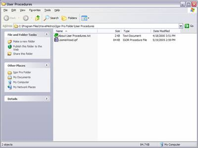

2.  Open the sample experiment, "ethylene-lw.pxp", in Igor.
The sample experiment contains a spectrum an line-listing of ethylene taken from the HITRAN database.

  

3.  Open the procedure window of your IGOR experiment.  (Press Ctrl-M.)
Add the line
```
#include "LoomisWood"
```
to the top of the procedure window.

  

  Close the procedure window.
  This will create the **Loomis-Wood** menu and make available all of the procedures associated with this add-in.

4.  Create a Loomis-Wood data set by selecting **Loomis-Wood | Data Sets | Create a New Loomis-Wood Data Set...**.

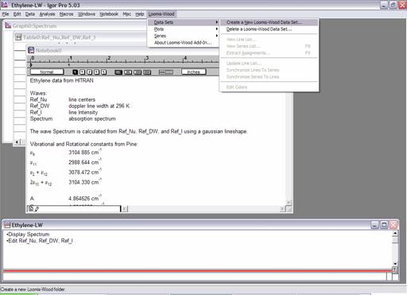

A dialog box will ask you for the name of the new folder:

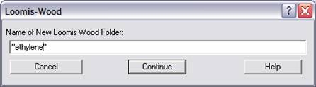

Enter “ethylene” then press continue.
A second dialog box will ask you to select the waves of your line listing.
Choose "Ref_Nu", "Ref_I", and "_constant_" in this dialog.

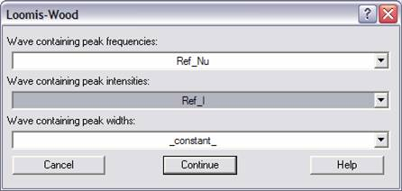

You can choose \_constant\_ if you do not have waves with line widths and/or line intensities.
You can work with multiple data sets in the same Igor Experiment by creating multiple Loomis-Wood folders.

5.  A Loomis-Wood plot named "Plot0" will be created automatically.

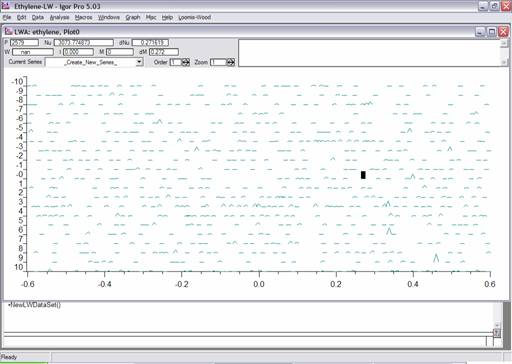

You can create multiple Loomis-Wood plots for the same
Loomis-Wood folder by selecting **Loomis-Wood | Plots | Create a New
Loomis-Wood Plot...**  A dialog box will ask you for the Loomis-Wood folder
containing the data for the plot, and a name for the subfolder that will
contain data specific to the new Loomis-Wood plot.

6.  In the new plot you will see the lines from your data set represented as triangles.
The height and width of these shapes will reflect the relative line intensities and the line widths of your data set. 
There is a cursor that you can move from line to line using the arrow keys.
If you click on a single line, the cursor will jump to that line.
At the top of the plot the details of the currently selected line are displayed.
You can use the PageUp and PageDn keys to scroll the plot up or down to the region of interest.

7.  Now, we need to find some constants that will make the display meaningful.
Switch to the graph of the spectrum by choosing **Windows | Graphs | Graph0:Spectrum** from the menu.

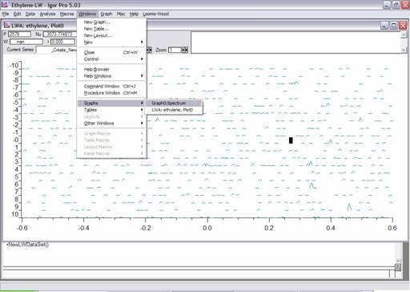

The graph of the spectrum will come to the top.  There are
some obvious series starting around 3145 cm<sup>-1</sup>.  Zoom in on this
region by creating a marquee with the mouse:

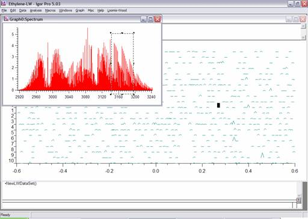

Right click on the marquee and choose Horiz Expand to zoom in
on this region.  Show Igor’s cursors by selecting **Graph | Show Info** from
the menu.

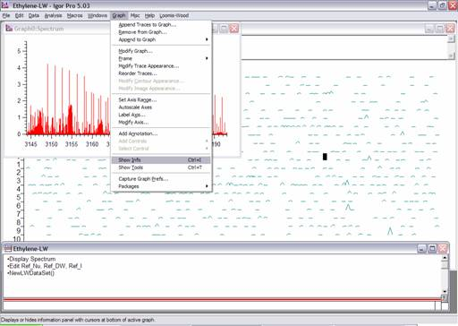

Now drag the cursors onto the first two lines of one of the
series (as shown below) so that you can estimate 2 _B_.

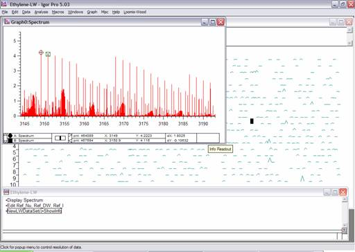

Notice that in the bottom of the window, dX is given as about 1.8.
We will take _B_ to be 0.9 cm<sup>-1</sup> and will use 3149 cm<sup>-1</sup> as a band origin.

8.  The next step is to edit the band constants to make the Loomis-Wood plot match a series in the spectrum.
Do this by choosing **Loomis-Wood | Plots | Edit Band Constants...**.

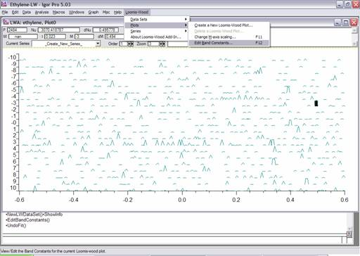

Even if you do not have precise constants for your molecule,
you will need to provide initial guesses for the band origin and rotational
constants to get a meaningful display.

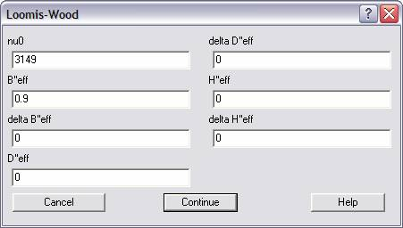

Enter 3149 and 0.9 into the dialog box and press Continue.

9.  If your band constants are reasonable, you should be able to identify a series as a vertical line of triangles in the display area.
You may need to scroll to the region of interest using the Page keys if you have not already done so.
If you cannot identify a series, you will need to go back to step 7 and refine your constants.
In this case, the constants are good enough to identify a series, which is circled below

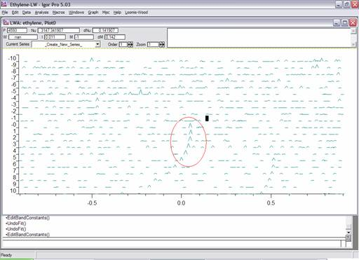

I recommend increasing the Zoom to around 5 to enhance the display.
(The zoom is increased using a control in the toolbar of the plot.)

10.  The next step is to assign a series.
Begin by creating a new series by choosing **Loomis-Wood | Series | Start a New Series...**.

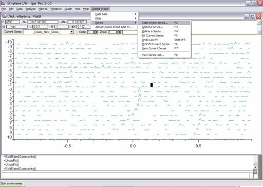

You will be asked to name the series and choose a color for
the series:

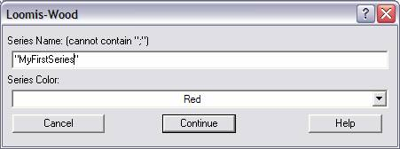

Give the series a name the click Continue.
You can now assign the series by selecting the lines to assign with the cursor and pressing the Enter key.
You can use the Delete key to remove an incorrect assignment. 
Assign the first five lines in the series, so that the display appears as below:

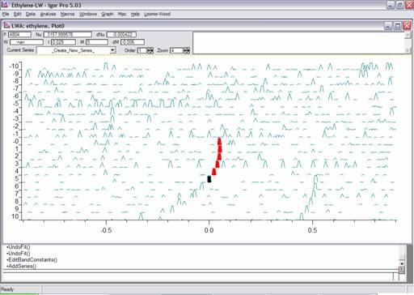

Notice that with the zoom increased, two other series are visible to the upper left and lower right of the current series.
Notice also on rows -5, -1, and 3 there are horizontal bands of strong lines.
This is the way _Q_-branches appear in a Loomis-Wood plot, although their appearance depends on how the lines are entered into the line listing.
Often you will have to consult the original spectrum to identify _Q_-branches.

11.  Once you have a series assigned or partially assigned, you can refine the rotational constants by performing a fit.
Do this by selecting **Loomis-Wood | Series | Fit Current Series**.

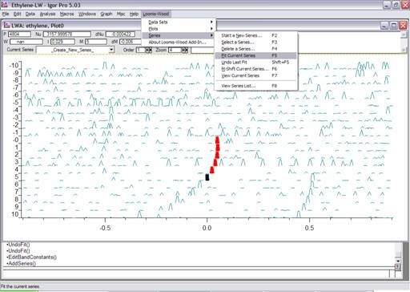

The results of the fit are shown below.  Notice that the assigned
lines are now centered horizontally.  However, there is still some curvature. 
Increase the order of the fit to two, using the control in the toolbar.  Then
fit the series again.

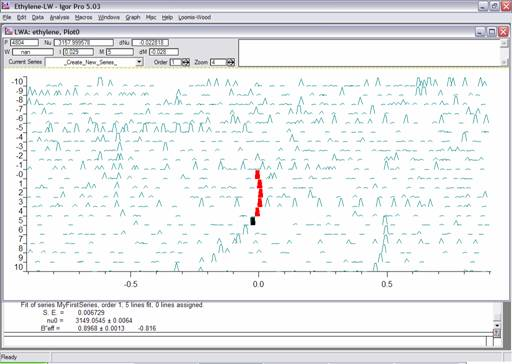

Now the series is fit much better:

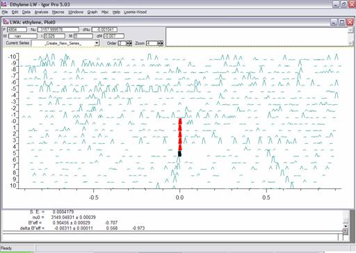

Notice that the results of the fit are printed in the History window.
You can also view/edit the constants using **Loomis-Wood | Plots | Edit Band Constants...**.

12.  If the value of _m_ is off (corresponding to misassignment of _J_),
then the constants produced by the fit will be meaningless.
To correct this, choose **Loomis-Wood | Series | M-Shift Current Series...**.
You will be asked for a correction which will be added to the current _m_ values of the current series.
In our case the _Q_-branch associated with the series we are analyzing is on row -5.
(Of course normally, one would have to confirm this by getting further in the assignment.)
Choose **Loomis-Wood | Series | M-Shift Current Series…**.

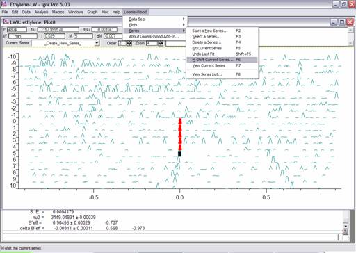

Enter 5 in the dialog box:

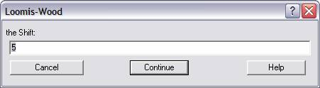

Now the series is assigned the correct value for _m_.


13.  Move the cursor onto an assigned line with the keypad or by single-clicking on the line.
Notice that in the control bar much information is given about the assigned line.

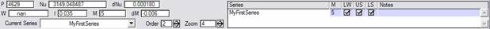

You can manually edit the _m_ value for the line in the ListBox control on the right side of the control bar.
You can also select/deselect one of three flags and give the assignment a note in this control.
The LW flag determines whether the add-in uses the line in fitting. 
The other two flags (Upper State and Lower State) are for external use by the user.
(The idea is that these flags can be useful for routines that extract combination differences.)
Note that you can also toggle these flags (for the current series) using the **K**, **U**, and **L** keys respectively.

14.  The series that we have just assigned is actually the <sup>r</sup>R_<sub>4</sub> series of the nu<sub>9</sub> band.
Now is a good time to give this series a more meaningful name.
Select **Loomis-Wood | Data Sets | Extract Assignments...**.

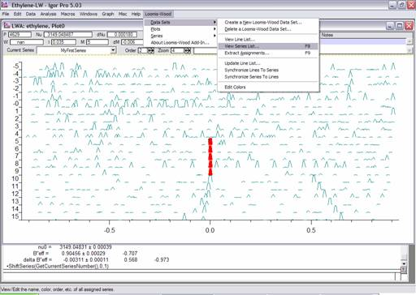

A table containing information about all of the series is displayed.
Change “MyFirstSeries” to “RR4” in this table.
You could also change the color code or the fit order of the series in this table.
An editable list of colors is available through **Loomis-Wood | Data Sets | Edit Colors…**.

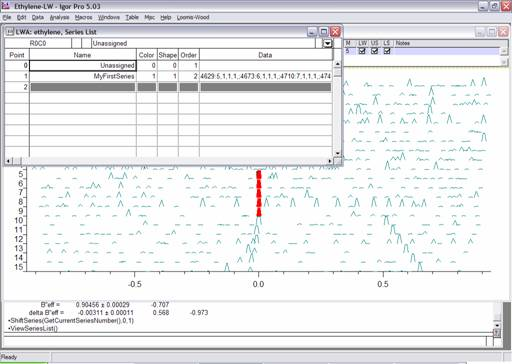

Close the table and reselect the Loomis-Wood plot.

15.  Repeat steps 8-14 to assign additional series.
Now is a good time to assign the _<sup>r</sup>R_<sub>5</sub> series which is visible to the lower right of the plot.
Make sure you get the _m_-shift correct.
After you assign the _<sup>r</sup>R_<sub>5</sub> series, try assigning the _<sup>r</sup>R_<sub>6</sub> series.
You should get a plot that looks something like below:

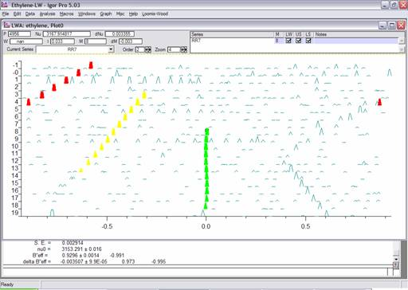

16.  A complete list of assignments can be created by selecting **Loomis-Wood | Data Sets | Extract Assignments...**.
(For now, choose "\_none\_" as the assignment function.)
A table of assignments will be created as follows:

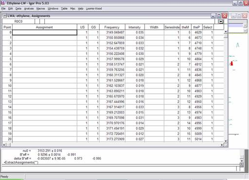

By implementing your own assignment function (See the manual.),
you can make this table suitable for input into more advanced fitting routine.

## Conclusion

This is the end of the Loomis-Wood tutorial.
Hopefully this will help you get started using the Loomis-Wood Add-In.
Remember, the Loomis-Wood Add-In is just a tool.
At all times, you need to understand what you are doing to get meaningful results.
The add-in is not a tool to allow novices to assign complicated spectra.
The add-in is a tool to help spectroscopists assign spectra faster with fewer mistakes,
since the add-in minimizes the need to manually assign and manipulate line-lists.
In particular, do not neglect to examine the actual spectrum to make sure your assignments make sense.
